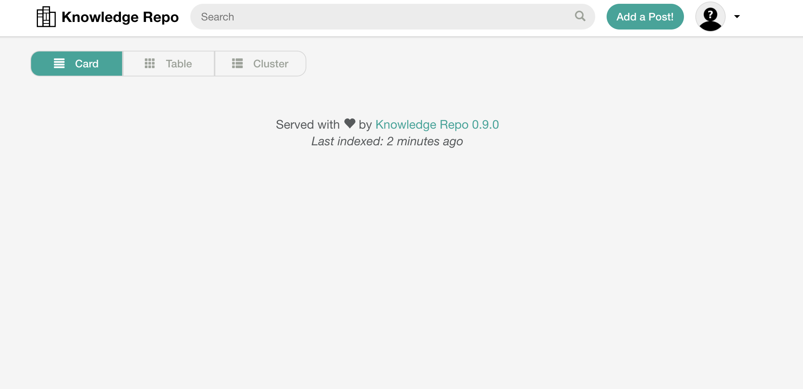
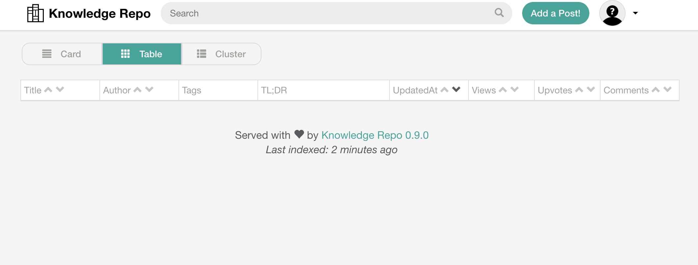
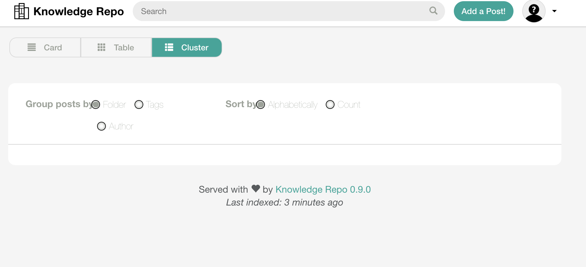
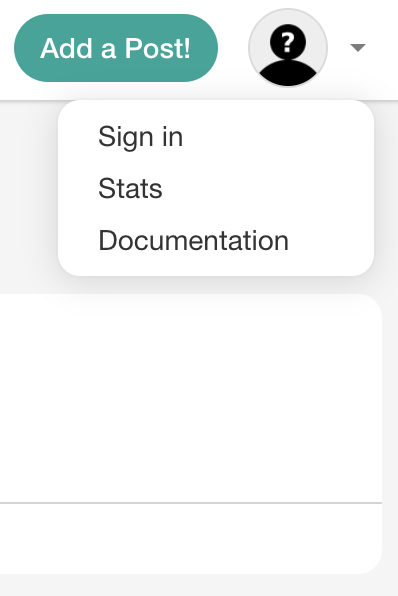
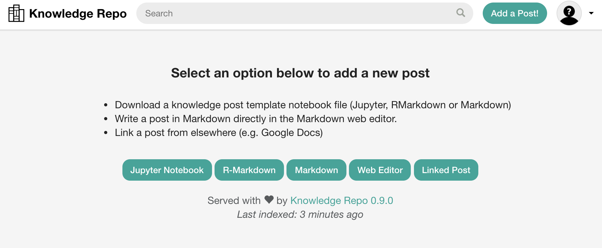
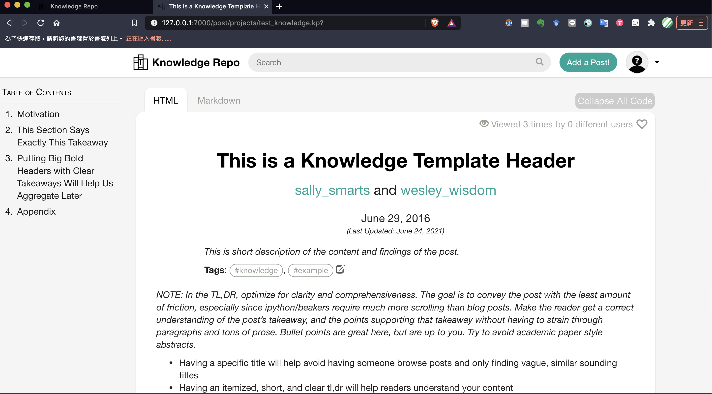
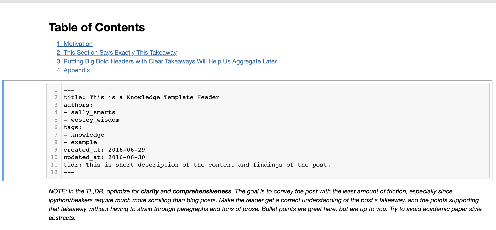
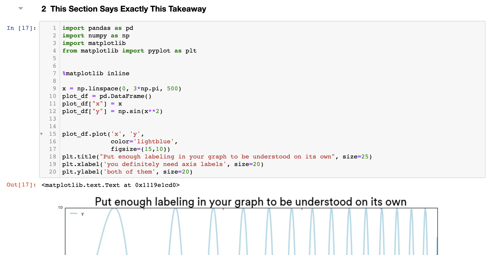

# Checklist

1. [ ] - support html?
   * [It's an open issue](https://github.com/airbnb/knowledge-repo/issues/336)
2. [ ] - support ipynb/rmd/md?
3. [ ] - sync with git?


# Installation

`https://knowledge-repo.readthedocs.io/en/latest/installation.html`

1. `(py_36_tf_21) YuLong@MacBook-Pro-3:~/Desktop/Working_Area/knowledge_repo_cheatsheet$ pip install --upgrade "knowledge-repo[all]"`

passed.

dependency :

pyyaml
markdown
pygments
gitpython
tabulate
cooked_input
requeests
flask==2.0.1
flask_login==0.5.0
flask-principal==0.4.0
flask-mail
flask-migrate
sqlalchemy
jinja2
werkzeug
guincorn
inflection
pillow
weasyprint
nbformat
traitlets
PyPDF2
wand
requests_oauthlib
ldap3
nose
beautifulsoup4
gitdb
typing-extensions
...

2. `(py_36_tf_21) YuLong@MacBook-Pro-3:~/Desktop/Working_Area/knowledge_repo_cheatsheet$ which knowledge_repo`

/Users/YuLong/miniconda3/envs/py_36_tf_21/bin/knowledge_repo

# Quick Start

- GitKnowledgeRepository: A repository backed by a local git repository (optionally synced with remote git repository).
  
- DbKnowledgeRepository: A repository backed by a database backend (most databases supported by SQLAlchemy can be used).


All backends also allow configuration using a YAML configuration file at ‘/.knowledge_repo_config.yml’
# Test

Failed

```
(py_36_tf_21) YuLong@MacBook-Pro-3:~/Desktop/Working_Area/knowledge-repo$ ./run_tests.sh

Setting up test environment
---------------------------

Removing artifacts from previous testing...
Creating a test repository in ./tests/test_repo...
Knowledge repository successfully initialized for uri `/Users/YuLong/Desktop/Working_Area/knowledge-repo/tests/test_repo`.
WARNING:knowledge_repo.repositories.gitrepository:This repository does not have a remote, and so post review is being skipped. Adding post directly into published branch...
INFO:knowledge_repo.repositories.gitrepository:Checking out (and/or creating) a new branch `master`...
INFO:knowledge_repo.repositories.gitrepository:Adding and committing 'projects/test/ipynb_test.kp' to local branch `master`...
/bin/sh: Rscript: command not found
Traceback (most recent call last):
  File "./scripts/knowledge_repo", line 286, in <module>
    kp = knowledge_repo.KnowledgePost.from_file(args.filename, src_paths=args.src)
  File "./scripts/../knowledge_repo/post.py", line 490, in from_file
    kp = KnowledgePostConverter.for_file(cls(), filename, format=format, postprocessors=postprocessors, interactive=interactive).from_file(filename, **opts)
  File "./scripts/../knowledge_repo/converter.py", line 50, in wrapped
    f(*args, **kwargs)
  File "./scripts/../knowledge_repo/converters/rmd.py", line 57, in from_file
    subprocess.check_output(runcmd, shell=True)
  File "/Users/YuLong/miniconda3/envs/py_36_tf_21/lib/python3.6/subprocess.py", line 356, in check_output
    **kwargs).stdout
  File "/Users/YuLong/miniconda3/envs/py_36_tf_21/lib/python3.6/subprocess.py", line 438, in run
    output=stdout, stderr=stderr)
subprocess.CalledProcessError: Command 'Rscript --no-save --no-restore --slave -e "library(rmarkdown);render('/Users/YuLong/Desktop/Working_Area/knowledge-repo/knowledge_repo/templates/knowledge_template.Rmd', '/var/folders/nm/7b0tg1dn77xfjkpwk_h__0kc0000gq/T/tmpizvej38g', output_format = html_document(keep_md = T));"' returned non-zero exit status 127.

```

# Git Knowledge Repo


`(py_36_tf_21) YuLong@MacBook-Pro-3:~/Desktop/Working_Area/knowledge_repo_cheatsheet$ knowledge_repo --repo . init`

WARNING:knowledge_repo.config:Configuration file /Users/YuLong/Desktop/Working_Area/knowledge_repo_cheatsheet/.knowledge_repo_config.yml does not exist.
WARNING:knowledge_repo.repositories.folder:Not overriding existing file 'README.md'.
Knowledge repository successfully initialized for uri `/Users/YuLong/Desktop/Working_Area/knowledge_repo_cheatsheet`.

some files are created , e.g. `.knowledge_repo_config.yml`

```
# A default YAML configuration for the repository.
# Please refer to config_defaults.py for documentation on what these options do

# The accepted path patterns should be provided as a dictionary mapping regex
# patterns to descriptions of that pattern.
path_patterns:
  '.*': "All paths are valid."

# A dictionary of aliases which point to knowledge posts. This allows you to alias posts
# which may be useful to forward old links to new locations, or to give certain posts
# precedence. It also allows the post path to violate the normal naming rules of posts.
# The only condition is that they cannot mask an existing post url, in which case the
# alias is silently ignored.
aliases: {}
...
```


By default, init treats the specified directory as a folder and not as a git repository. In case you wish to create a git repository when initializing the knowledge repo, make sure to prefix git:///:


### upgrade git repo to knowledge repo

pass

add ssh 

pass

# Database Knowledge Repo

pass

allow to push by webUI

# Deploying the Web Application

`(py_36_tf_21) YuLong@MacBook-Pro-3:~/Desktop/Working_Area/knowledge_repo_cheatsheet$ knowledge_repo --repo . runserver`

```
INFO:knowledge_repo.app.app:Set KNOWLEDGE_REPO_MASTER_UUID to '498ff698-7c93-4094-a1a6-27e4f09fde95'.
INFO:alembic.runtime.migration:Context impl SQLiteImpl.
INFO:alembic.runtime.migration:Will assume non-transactional DDL.
 * Serving Flask app 'knowledge_repo.app.app' (lazy loading)
 * Environment: production
   WARNING: This is a development server. Do not use it in a production deployment.
   Use a production WSGI server instead.
 * Debug mode: off
WARNI [werkzeug]  * Running on all addresses.
   WARNING: This is a development server. Do not use it in a production deployment.
INFO  [werkzeug]  * Running on http://192.168.163.57:7000/ (Press CTRL+C to quit)
```

`--port` : 

`--dburi` : SQLAlchemy URI


For shared deployments, however, you will probably need to create a server configuration file. A complete server configuration template can be found here. The configuration file gives you fine-grained control over the deployment, including authentication, access policies, indexing behavior.


</img>
</img>
</img>
</img>
</img>

You can also deploy with config file

`knowledge_repo --repo <repo_path> deploy --config <config_file>`

You can download an template from `Add a post`

# Add posts!

## Create knowledge post

download on the web or

`knowledge_repo --repo <repo_path> create {ipynb, Rmd, md} filename`

a basic file will contains 

```
---
title: I Found that Lemurs Do Funny Dances
authors:
- sally_smarts
- wesley_wisdom
tags:
- knowledge
- example
created_at: 2016-06-29
updated_at: 2016-06-30
tldr: This is short description of the content and findings of the post.
---

```

## Adding

`(py_36_tf_21) YuLong@MacBook-Pro-3:~/Desktop/Working_Area/knowledge_repo_cheatsheet$ knowledge_repo --repo . add hello_world_ipynb.ipynb -p projects/test_knowledge`

add file : just like git add

-p post path on the web_app, we can search them like a filesystem.

## Updating

pass

## Previewing

`(py_36_tf_21) YuLong@MacBook-Pro-3:~/Desktop/Working_Area/knowledge_repo_cheatsheet$ knowledge_repo --repo . preview projects/test_knowledge`

Please preview at an empty port. or errors comes out.

</img>

the original ipynb content : 

</img>

</img>

## Submitting


`(py_36_tf_21) YuLong@MacBook-Pro-3:~/Desktop/Working_Area/knowledge_repo_cheatsheet$ knowledge_repo --repo . submit projects/test_knowledge`

now check the flask app


## Docker-version

/Users/yulongtsai/Desktop/Working_Area/knowledge-repo-docker

目前 docker 還有點問題，應該是要從docker image調整，或是等待官方docker image 釋出